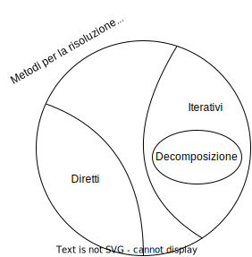

# Metodi di decomposizione

Sono una sottofamiglia dei metodi iterativi di risoluzione dei sistemi lineari.
Si dicono _di decomposizione_ perché andiamo a smontare la matrice.

La decomposizione di A è basata sulla differenza di due matrici: M e N.

$$A = M - N$$

Scegliendo M come matrice del metodo: $MX = Nx - b$ (N è automaticamente determinata, N = M - A).

Alla prima iterazione: $M x^{(1)} = N x^{(0)} + b$. Quello che ottengo è un vettore $p = Nx - b$.

Quindi $Mx^{(1)} = p$ e l 'ultima cosa da fare è risolvere il sistema lineare.

In generale al passo k:

$$
M x^{(k+1)} = N x^{(k)} + b
$$

La matrice M va scelta in modo che si possa ottenere una soluzione al sistema dal basso costo computazionale.

Per le famiglie di metodi di Jacobi e Gauss-Seidel, andiamo a decomporre in tre matrici e le combiniamo in due
modi diversi.

$$
A = D - E - F
$$

La matrice D è la diagonale di A

$$
D = \begin{pmatrix} a_{11} & 0 & \dots & 0\\0 & a_{22} & \dots & 0\\\vdots & \vdots & \ddots & \vdots\\0 & 0 & \dots & a_{nn}\\ \end{pmatrix}
$$

E è il triangolo inferiore di A cambiato di segno

$$
E = \begin{pmatrix} 0 & 0 & \dots & 0\\-a_{21} & 0 & \dots & 0\\\vdots & \vdots & \ddots & \vdots\\-a_{n1} & -a_{n2} & \dots & 0\\ \end{pmatrix}
$$

F è il triangolo superiore cambiato di segno

$$
F = \begin{pmatrix} 0 & -a_{12} & \dots & -a_{1n}\\0 & 0 & \dots & -a_{2n}\\\vdots & \vdots & \ddots & \vdots\\0 & 0 & \dots & 0\\ \end{pmatrix}
$$

Il metodo di Jacobi predilige $M = D$, di conseguenza $N = E + F$. Mentre Gauss-Seidel usa $M = D-E$ e $N=F$.

# Metodo di Jacobi

$$M = D, N = E + F$$

$$Ax = b$$

$$Mx = Nx + b$$

$$Dx^{(k+1)} = (E+F) x^{(k)} + b$$

Implementato per componenti:

$d := diag(D) = \begin{pmatrix} a_{11} & a_{22} & \dots & a_{nn}\\ \end{pmatrix}$

$x^{(k+1)} = [(E+F) x^{(k)} + b] ./ d$

$$
\begin{pmatrix} x^{(k+1)}_{1}\\x^{(k+1)}_{2}\\\vdots\\x^{(k+1)}_{n}\\ \end{pmatrix}

=

[

\begin{pmatrix} 0 & a_{12} & \dots & a_{1n}\\a_{21} & 0 & \dots & a_{2n}\\\vdots & \vdots & \ddots & \vdots\\a_{n1} & a_{n2} & \dots & 0\\ \end{pmatrix}

\begin{pmatrix} x^{(k)}_{1} \\ x^{(k)}_{2} \\ \dots \\ x^{(k)}_{n}  \end{pmatrix}

+

\begin{pmatrix} b_{1} \\ b_{2} \\ \dots \\ b_{n}  \end{pmatrix}

] /

\begin{pmatrix} a_{11}\\a_{22}\\\vdots\\a_{nn}\\ \end{pmatrix}
$$

per cui:

$$x_i^{(k+1)} = (b_i - \sum_{j=1,j\ne i}^{n} a_{ij} x_j^{(k)}) / a_{ii}, i = 1, \dots, n$$

Ogni componente di questa iterata $x^{(k+1)}$ si calcola sono in funzione dell'elemento dell'iterata precedente x^{(k)}.

Faccio una moltiplicazione matrice-vettore e poi risolvo un sistema diagonale a ogni iterazione.

### Gauss-Seidel

$$
M = D - E \\
N = F \\
(D - E)x^{(k+1)} = F x^{k} + b
$$

Faccio una moltiplicazione matrice-vettore e risolvo un sistema triangolare inferiore a ogni iterazione.

Il metodo di Jacobi è parallelizzabile, mentre Gauss-Seidel usa il metodo degli spostamenti successivi (per cui la
soluzione corrente dipende anche dall'iterazione corrente) e quindi non è parallelizzabile.

L'interpretazione grafica di Jacobi è che il punto che rappresenta la soluzione orbita intorno alla soluzione corretta
e la tocca a infiniti passi.

L'interpretazione grafica di Gauss-Seidel è che l'iterata raggiunge una delle due rette e poi comincia a spostarsi
attorno alla soluzione rimanendo sempre sulla retta scelta.

## Convergenza dei metodi

Se A è strettamente diagonale dominante per righe, allora i metodi di decomposizione di Jacobi e Gauss-Seidel convergono.

Per dimostrare la convergenza dobbiamo dimostrare che la norma matrice del metodo è minore di 1.

$$
x^{(k+1)} = M x^{(k)} + c \\
x^{(k+1)} = \mathcal{J} x^{(k)} + c \\
$$

### Jacobi

$$
\mathcal{J} = D^{-1}(E+F) \\
c = D^{-1}b \\
$$

Per ipotesi abbiamo che la matrice sia strettamente dominante per righe, quindi gli elementi della diagonale sono
maggiori in valore assoluto della somma dei valori assoluti della riga (escluso l'elemento diagonale).
Cioè:

$$
|a_{ii}| \lt \sum_{j=1, j\ne i}^{n} |a_{ij}| \ \forall i=1,...,n
$$

e vogliamo dimostrare che $||\mathcal{J}|| \lt 1$, in particolare scegliamo la norma infinito.

La norma infinito di una matrice è il massimo della somma in valore assoluto delle righe. Per la matrice del metodo
di Jacobi è:

$$
||J||_\infty = \max \sum_{i=1, i \ne j}^{n} \frac{|a_{ij}|}{|a_{ii}|}
$$

siccome la matrice è strettamente dominante per righe, allora ogni elemento della diagonale di A (che nella matrice
$\mathcal{J}$ divide ogni elemento della riga corrispondente) è maggiore della somma degli elementi della riga per cui
possiamo affermare che la norma infinito è sempre $\lt 1$.

La dimostrazione è conclusa.

### Gauss-Sidel

Per la dimostrazione uso il risultato che lega il raggio spettrale della matrice del metodo con la convergenza.

Tesi:

$$
\rho(\mathcal{G}) \lt 1
$$

## Velocità di convergenza

Tanto più è piccolo il raggio spettrale della matrice del metodo, tanto più velocemente il metodo converge.

Si può dimostrare che Gauss-Seidel è non meno veloce di Jacobi, per cui $\rho(\mathcal{G}) \lt \rho(\mathcal{J})$.
