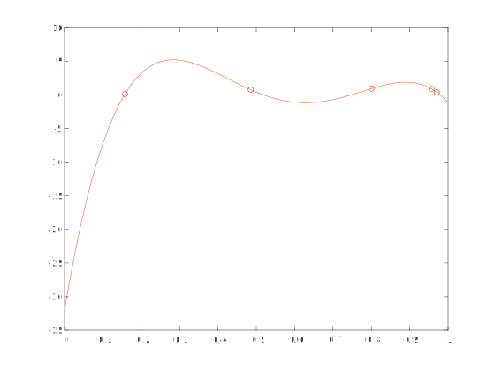

# Interpolazione

I problemi di interpolazione hanno l'obiettivo di trovare una legge per ricostruire una funzione partendo da alcuni
punti che rappresentano i valori di quella funzione.

Le funzioni che passano per n punti sono infinite. Possono essere continue o definite a tratti, non derivabili etc.

Un altro problema, questa volta bidimensionale, è l'ingrandimento di un'immagine. Un'immagine è una matrice, se voglio
scalarla devo avere un criterio per determinare i nuovi punti che riempiono la matrice.

> Una funzione g si dice che _interpola_ un'altra funzione f se $g(x_i) = y_i, \forall i = 0, \dots, n$.

Le ascisse dei dati (gli $x_i$) si chiamano nodi.

Una delle prime scelte per interpolare i dati è usare i polinomi. Sfruttiamo il _teorema fondamentale dell'algebra_ che
dice:

> dati n+1 punti del piano, esiste un'unico polinomio di grado al più n, denotato con $p_n(x)$ che li interpola, ovvero
tale che $p_n(x) = y_i, i=0, \dots, n$.

## Come costruire p(x)

Dal punto di vista analitico, determinare il polinomio significa determinare i coefficienti.
Infatti per n+1 punti avremo un polinomio:

$$
y = a_n x^n + a_{n-1} x^{n-1} + \dots + a_1 x^1 + a_0 x^0
$$

a n coefficienti $\begin{pmatrix} a_0 & a_{1} & a_{2} & ... & a_{n}  \end{pmatrix}$.

In un polinomio in forma canonica i termini dello stesso grado compaiono solo una volta, se un polinomio non è in c.f.
basta sommare i termini dello stesso grado ed esplicitare (con 0) quelli che non compaiono.

Siccome c'è anche $x_0$ il grado è n (numero punti meno 1), però il vettore dei coefficienti è n+1.

## Dati

$(x_i, y_i)$ n+1 punti con $i=0, \dots, n$. Se p(x) passa per tutti i punti vuol dire che $y_i = p(x_i)$ per ogni i.

Ad esempio:

$$
a_0 + a_1 x_0 + a_2 x_0^2 + \dots + a_n x_0^n = y_0
$$

Adesso imponiamo il passaggio per un altro punto: $p_n(x_1) = y_1$.

$$
a_0 + a_1 x_1 + a_2 x_1^2 + \dots + a_n x_1^n = y_1
$$

di queste equazioni ne posso impostare n+1, quindi otterrò una matrice quadrata di dimensioni n+1 x n+2.

Nonostante ci siano delle potenze, si genera un sistema di equazioni lineari perché le incognite non sono le x, bensì
i coefficienti $a$ che sono tutti di grado 1.

Adesso chiamiamo il vettore dei coefficienti $\alpha = \begin{pmatrix} a_0 & a_{1} & a_{2} & ... & a_{n}  \end{pmatrix}$
che sarà il vettore delle incognite.

La matrice quadrata n+1 x n+1 dei coefficienti si chiama V dove la prima colonna è tutta di 1 (sarebbero gli $x_n^0$).
Prende il nome di matrice di Vandermonde.

Quindi il sistema in forma matriciale diventerà $V \alpha = y$. Una volta risolto possiamo definire il polinomio
interpolante.

Il determinante di V è $\Pi_{i \lt j} (x_i - x_j)$, quindi il prodotto di tanti nodi. Questo vuol dire che se due nodi
non sono uguali allora il determinante è diverso da 0.

Purtroppo non è un buon metodo perché solitamente la matrice è malcondizionata.

La base canonica dello spazio dei polinomi è:

$$
1, x, x^2, \dots, x^n, \dots
$$

che ha dimensione n+1.

Il polinomio che vogliamo costruire deve soddisfare tutte queste condizioni:

$$
\begin{cases}
P_n(x_1) = y_1 \\
P_n(x_2) = y_2 \\
\dots \\
P_n(x_n+1) = y_{n+1} \\
\end{cases}
$$

Il limite principale di questo metodo è che la matrice di Vandermonde è malcondizionata.
Invece un vantaggio è che usando la base canonica per costruire il polinomio, posso valutare la funzione interpolata
su un numero di punti a piacere.

## Aggiungiamo un constraint

Voglio che la funzione interpoli un nuovo punto $\overline{x}$, allora aggiungo una riga e una colonna cosicché
la nuova matrice $V'$ diventi siffatta:

$$
V' = \begin{pmatrix} 1 & x_1 & x_1^2 & x_1^3\\1 & x_2 & x_2^2 & x_2^3\\1 & x_3 & x_3^2 & x_3^3
\\1 & \bar{x} & \bar{x}^2 & \bar{x}^3\\ \end{pmatrix}
$$

Un esempio di interpolazione:

## Altri modi di costruire V

$P_n(x)$ è costruito a partire dalla base canonica $1, x, x^2, x^3, \dots, x^n$. Con la classe di funzioni

$$
x^i : \mathbb{R} \to \mathbb{R} \\
\forall i \ge 0 \\
x \mapsto x^i
$$

Consideriamo il caso con due punti $p_0$ e $p_1$, allora abbiamo che

$$
\frac{y - y_0}{x - x_0} = \frac{y_1 - y_0}{x_1 - x_0}
$$

dove la parte a sinistra è una retta che passa per $p_0$, poi a destra impongo anche il passaggio per $p_1$.

Posso riscrivere la retta così:

$$
p_1(x) = y_0 \frac{x - x_1}{x_0 - x_1} + y_1 \frac{x - x_0}{x_1 - x_0}
$$

chiamiamo quindi $L_0(x)$ il termine $\frac{x - x_1}{x_0 - x_1}$ e $L_1(x)$ il termine $\frac{x - x_0}{x_1 - x_0}$.

Lo scotto da pagare è che questi elementi non sono più della base canonica, però si guadagna perché i termini sono
definiti proprio sulle ascisse dei punti.

Queste due funzioni L valgono 0 nel primo nodo e 1 nel secondo e arrivano a $L_1(x)$ e $L_0(x)$.

## Forma di Lagrange

Possiamo riscrivere un generico polinomio di dimensione n con la rappresentazione in forma di Lagrange.

La base di Lagrange è:

$$
{L_0(x), L_1(x), \dots, L_n(x)}
$$

$$
L_k(x) = \begin{cases}
L_k(x_k) = 1 \\
L_k(x_j) = 0
\end{cases}
$$

Quindi abbiamo spostato la computazione nel calcolo degli elementi della base.

In forma esplicita è chiaro che se la funzione viene valutata in uno dei nodi, la funzione si annulla perché si
annulla uno dei monomi al numeratore.
Quindi nei monomi al N non metto il monomio $(x-x_k)$ per evitare che si annulli.

Voglio **normalizzare** la funzione, quindi divido per tutti gli $(x_k - x_j)$.

$$
y = p_n(x) = y_0 L_0 + y_1 L_1 + \dots + y_k L_k + \dots + y_n L_n(x) = \\

\sum_{k=0}^{n} y_k L_k(x)
$$

## Base di Lagrange

Sto rappresentando lo stesso polinomio, ma ho cambiato base. Ho una combinazione lineare di $y_j$.

$$
L_k(x) : \begin{cases}  %tale che
L_k(x_k) = 1
\\
L_k(x_j) = 0, \forall j \ne k %qualsiasi altro nodo
\end{cases}
$$

Dal teorema fondamentale dell'algebra esiste un solo polinomio che interpola questi punti.
Quindi in generale ciascun $L_k$ elemento della base di Lagrange è un polinomio di grado n (ho n+1 punti).

Un polinomio di grado n a coefficienti reali può essere scomposto in $\mathbb{R}$
al più di n monomi del tipo $(x - k)$. Cioè se un polinomio è totalmente scomponibile in $\mathbb{R}$, allora si può
scomporre in n fattori.
E questo ha senso perché ho n punti posti a zero, e uno posto a 1. Quindi avrò n zeri, cioè monomi del tipo $(x - k)$.

$$
(x - x_0)(x - x_1)(x - x_2) \cdot ... \cdot (x - x_{k-1})(x - x_{k+1})\cdot ... \cdot (x - x_n)
$$

E non metto $(x-x_k)$ così non si annulla in $x_k$, dove deve valere 1.

Se calcolo il polinomio di Lagrange in $x_k$ mi ritrovo con un $(x_k - x_0)(x_k - x_1)\cdot ... \cdot (x_k - x_n)$, che
quindi metto al denominatore quei termini, che sono differenze di nodi, numeri reali, così da normalizzare il termine.

Per compattezza posso anche scrivere:

$$
L_k(x) = \prod_{i=0, i\ne k}^{n} \frac{x - x_i}{x_k - x_i}
$$

L'insieme ${L_k}_{k=0, \dots, n}$ viene detta base di Lagrange, e a differenza della _base dei monomi_
($1, x, x^2, \dots, x^n$) dipende dai nodi.

## Una digressione alegbrica sugli spazi vettoriali

Consideriamo un polinomio $p_n(x) = a_n x^n + a_{n-1} x^{n-1} + \dots + a_1 x + a_0$.

La base dei monomi è $x^n, x^{n-1}, \dots, x, 1$. Posso quindi associare un vettore $(a_n, \dots, a_0)$ di n+1 termini
associato ai coefficienti del polinomio. Sono due modi diversi di dire la stessa cosa, sapendo come combinare la base
e il vettore.

$(a_n, \dots, a_0)$ è un vettore nello spazio $\mathbb{R}^{n+1}$.

Questa funzione è _biiettiva_, ovvero a ciascun polinomio corrisponde un vettore e a ciascun vettore corrisponde un
polinomio. Possiamo concludere che algebricamente la loro struttura è la stessa, quindi hanno le stesse proprietà.

Siccome $\mathbb{R}^{n+1}$ è uno spazio vettoriale possiamo trasportarlo sull'insieme dei polinomi di grado al più n.

Nel nostro parallelo la base è quella canonica: $(1, 0, 0, \dots, 0)$ ($x^0$), $(0, 1, 0, \dots, 0)$ $(x^1)$ etc.

Esistono infinite basi in uno spazio vettoriale. Quello che distigue la base canonica dalle altre è che i vettori della
base canonica sono tutti ortogonali tra loro o normalizzati (la loro norma è 1).

I vettori di una base devono essere linearmente indipendenti, e l'altra proprietà fondamentale è che devono generare
tutto lo spazio; ovvero qualsiasi vettore dello spazio deve essere costruito a partire dalla base. La dimensione della
base deve essere $n+1$ (nel nostro caso).

Sostanzialmente la base di Lagrange è un modo diverso di rappresentare un polinomio, che è un vettore.
Dobbiamo quindi dimostrare che la nostra costruzione sia effettivamente una base:

- dimostriamo che ogni vettore può essere scritto come combinazione degli $L_k$;

- dimostriamo che gli $L_k$ sono linearmente indipendenti.

### Indipendenza lineare

Per dire che un insieme è linearmente indipendente, prendiamo un numero opportuno di scalari $\lambda$, la poniamo
uguale a 0 e dimostriamo che tutti gli scalari non possono essere contemporaneamente nulli.

Siano $\lambda _0, ..., \lambda _n$ n+1 coefficienti reali tali che $\sum_{k=0}^{n} \lambda_k L_k = 0 \forall x \in
\mathbb{R}$, siccome gli L sono delle funzioni di classe C-infinito (definite su tutto R).

In particolare l'uguaglianza deve valere per i punti di interpolazione, ossia per gli $x = x_k$.

Quindi $0 = \sum_{i=0}^{n} \lambda_i L_i = \lambda_k L_n(x_k) = \lambda_k$, perciò $\lambda_k = 0$ per ogni k.
Da cui segue la lineare indipendenza della base di Lagrange.

$$
q(x) = a_n x^n + a_{n-1} x^{n-1} + ... + a_2 x^2 + a_1 x + a_0
$$

è fissato, cioè gli $a_n, \dots, a_2, a_1, a_0$ sono noti.

Scegliamo n+1 nodi (ascisse) che chiamiamo $x_0, x_1, ..., x_n$. A questo punto calcoliamo q in ciascuno dei nodi.
$y_i = q(x_i) \ \forall i = 0, ..., n$.

Graficamente ho un polinomio e n+1 punti. Dal teorema fondamentale so che per n+1 punti passa solo un polinomio, allora
anche con la base di Lagrange il polinomio sarà unico.

Dunque la base di Lagrange è valida, al più n, e valida come base dello spazio vettoriale $\mathbb{R}^{n+1}$$.

La parte più computazionalmente costosa è determinare la base di Lagrange in $\overline{x}$. Per velocizzare, siccome
devo ricalcolare più volte gli stessi monomi, posso memorizzare direttamente le computazioni dei $(x - x_i)$.

Calcolo $w_n(x) = (x - x_0)(x - x_1) \cdot ... \cdot (x - x_n)$. Per calcolare quindi tutti gli L basterà fare:

$$
L_i(x) = \frac{w_n(x)}{(x-x_0)D}
$$

potremmo avere problemi nel valutare $L_i$ in $x_i$, ma non avrebbe senso perché già sappiamo che vale 1.

Bisogna sempre controllare che il punto richiesto sia diverso da un nodo.

### Svantaggi

Se voglio aggiungere un nodo di interpolazione, quindi aumentare il grado del polinomio, devo ricalcolare la base
di Lagrange.

## Problema dell'approssimazione

Vedi la funzione di Runge

> Dati un certo numero di punti del piano $(x_i, y_i)$ tali che $y_i = f(x_i)$ dove f è una funzione che può non essere
> disponibile in forma analitica. Approssimare significa definire una funzione g che assomigli il più possibile a f.

La soluzione numerica al problema è definire un algoritmo che possa calcolare la funzione g in qualsiasi punto
dell'intervallo di riferimento dell'intervallo di riferimento $[a, b]$

## Assomigliarsi

> Una funzione g assomiglia a f se i loro grafici sono vicini tra di loro, ovvero se la norma infinito di $f-g$ è minore
> di un certo epsilon.

Poniamo di avere un vettore di posizionamento "denso", per cui otteniamo un intervallo [a, b] e al posto del vettore y
avremo la funzione f definita nell'intervallo.

Una volta definita una norma, bisogna definire una distanza. Uno spazio che ha distanze è uno **spazio metrico**.

$||f - p_n|| \to 0$ quando $n \to \infty$. Questa scrittura adesso ha perfettamente senso.
