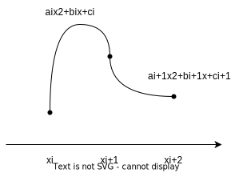
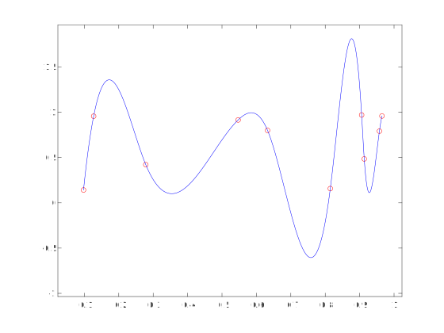

# Interpolazione linearea tratti

Dati m+2 nodi $(x_i, y_i)$, $i = 0, \dots, m+1$, Chiamiamo interpolazione lineare a tratti:

$$
\frac{s_i(x) - y_i}{y_{i+1} - y_i} = \frac{x - x_i}{x_{i+1} - x_i}
\\
s_i : y = mx + q
$$

se $y_i \ne y_{i+1}$ allora possiamo scrivere $s_i(x)$ in forma esplicita:

$$
s_i(x) = \frac{x - x_i}{x_{i+1} - x_i} (y_{i+1} - y_i) + y_i \Rightarrow
s_i(x) = x\frac{y_{i+1} - y_i}{x_{i+1} - x_i} + y_i - x_i \frac{y_{i+1} - y_i}{x_{i+1} - x_i}
$$

in modo da esplicitare m e q. Questa interpolazione è interessante perché non è sempre possibile campionare la mia
funzione con una distribuzione come quella di Chebychev. Spesso infatti la distribuzione dei dati sull'asse x
è equispaziata.

Interpolando in questo modo non si va incontro al fenomeno di Runge. Inoltre quando si hanno molti punti, si ricava un
polinomio di grado molto alto che può non rispecchiare il vero andamento del valori; oltre a essere difficile
da calcolare.

$$
S : [a, b] \to \mathbb{R} \\

S(x) = S_i(x), x \in [x_i, x_{i+1}] \\

S(x) = \begin{cases}
S_0(x), x \in [x_0, x_1] \\
S_1(x), x \in [x_1, x_2] \\
\vdots \\
S_m(x), x \in [x_m, x_{m+1}]
\end{cases}
$$

la funzione S è continua, ma perdiamo la derivabilità. In particolare nei nodi.

$$
S \in \mathit{C}\ ^0_{[a,b]}
$$

## Fenomeno di Runge

Non si può verificare in questo caso. Perché?

Supponiamo che i nostri nodi siano venuti fuori da un campionamento s di una funzione f di classe $\mathit{C}\ ^2$
sull'intervallo [a, b].

Andiamo a studiare la funzione resto $R(x) = f(x) - s(x)$ su un intervallino generico:

fissato un i in {0, 1, ..., m, m+1}, l'errore di interpolazione è:

$$
R(x) = f(x) - s_i(x) = \frac{(x - x_i)(x - x_{i+1})}{2!} f^{(2)}(\xi)
$$

e questa espressione è vera per ogni espressione che appartiene a $[x_i, x_{i+1}]$.

Siccome f è di classe C2 su tutto [a, b], allora esiste il massimo sull'intervallo e in questo modo non dipende più
dall'intervallo che stiamo considerando.

$$
\exists \max_{x \in [a,b]} |f^{(2)}(x)| = M
$$

consideriamo il valore assoluto, tanto la funzione è continua. Questo M maggiora tutte le derivate seconde.

$$
|R(x)| = \frac{|(x - x_i)(x - x_{i+1})|}{2} |f^{(2)} (\xi)|
$$

in ciascuno dei sottintervalli possiamo maggiorare il resto con

$$
|R(x)| \le \frac{1}{2} \frac{(x_{i+1} - x_i)^2}{4} \  \forall x \in [x_i, x_{i+1}]
$$

l'unico pezzo che dipende dall'intervallo è $(x_{i+1} - x_i)^2$. Se prendo un intervallo più lungo posso maggiorare
tutti i pezzi di R.

$$
||R(x)||_\infty = \max_{x \in [a, b]} |f(x) - s(x)| \le \max_{x \in [a, b]} \frac{M}{8} h^2 = \frac{M}{8} h^2
$$

nel caso particolare di nodi equispaziati $h = \frac{b-a}{m+1}$ (perché ho m+2 punti, quindi m+1 intervalli).

$$
h = \frac{b-a}{m+1} \Rightarrow ||R(x)||_\infty \le \frac{M}{8} \frac{(b-a)^2}{(m+1)^2}
$$

per m a infinito, convergiamo a 0.

Lo scotto che andiamo a pagare per un'interpolazione lineare a tratti è avere una funzione continua ma non più
derivabile, anche se non abbiamo più il fenomeno di Runge.

## Spline

Definiamo lo spazio delle funzioni spline, informalmente, come la classe di funzioni polinomiali a tratti molto
regolari. Ovvero invece di approssimare ogni tratto tra i punti con una retta, uso un polinomio di grado superiore.

Utilizzando le parabole possiamo anche imporra la continuità della derivata prima.

La funzione spline è reale definita a tratti. $S: [a, b] \to \mathbb{R}$

$$
S(x) = \begin{cases}
S_0 (x), x \in [x_0, x_1] \\
S_1 (x), x \in [x_1, x_2] \\
S_2 (x), x \in [x_2, x_3] \\
S_3 (x), x \in [x_3, x_4]
\end{cases}
$$

Ogni $S_i$ è una parabola, quindi $S_i(x) = a_i x^2 + b_i x + c_i$

Per ogni parabolina, imporre il passaggio per due punti significa fissare due condizioni.
$S_i(x_i) = y_i$ e $S_i(x_{i+1}) = y_{i+1}$.

Per imporre la continuità della derivata prima, possiamo scrivere le derivate come: $S'_i(x) = 2a_i x + b_i$.
Quindi nei tre nodi interni la derivata destra deve essere uguale alla derivata sinistra.

Perciò, con 5 punti quindi 4 tratti, abbiamo le seguenti condizioni:

$$
\begin{cases}
S_0(x_0) = y_0, S_1(x_1) = y_1 \\
S'_0(x_1) = S'_1(x_1) \\
S_1(x_1) = y_1, S_2(x_2) = y_2 \\
S'_1(x_2) = S'_2(x_2) \\
S_2(x_2) = y_2, S_3(x_3) = y_3 \\
S'_2(x_3) = S'_3(x_3) \\
S_3(x_3) = y_3, S_4(x_4) = y_4 \\
\end{cases}
$$

abbiamo 11 condizioni, quindi ci rimane un parametro libero. Questo accade anche con gradi superiori, dove abbiamo più
parametri liberi.

Le incognite sono 12, perché sono i tre coefficienti $a, b, c$ per ogni tratto (e i tratti sono 4).

Scegliendo grado 2 posso imporre fino a C1 come classe. $S \in \mathit{C}^1_{[a,b]}$.

La funzione s(x) ristretta nell'intervallo è un polinomio di grado *al più n* perché nel caso abbia due punti uguali,
avrei in un'equazione un parametro in meno da determinare. Alcuni tratti possono essere di grado inferiore.

Le spline cubiche necessitano di 3 condizioni di regolarità:

$$%todo$$

che di solito non si impongono agli estremi.

## Spazio delle spline

Ogni pezzo di spline è un polinomio di grado n, cioè dipende da n+1 parametri. In tutto ci sono m+1 pezzi, con m+2
punti. Quindi una spline è definita da una matrice (m+1)(n+1).

Le condizioni di regolarità sono nm uguaglianze. Infine abbiamo n+m+1 parametri, ovvero i gradi di libertà della spline.

Determinare una spline di grado n è comunque risolvere un sistema lineare... con le tecniche viste nella prima parte
del corso.

## Determinare i parametri liberi

In una spline cubica abbiamo due parametri liberi. Di solito si fanno tre tipi di scelte:

- spline cubica naturale,
    imponendo le condizioni per cui i punti di estremo sono flessi (cambia la concavità);

- spline cubica periodica,
    quando $y_0 = y_m+1$, imponiamo la continuità della derivata prima e seconda tra gli estremi chiudendo di fatto
    su sè stesso l'intervallo [a, b]: condizione di circolarità;

- spline cubica not-a-knot,
    Matlab assicura che il primo set di 3 punti e l'ultimo siano polinomi di grado 3 (complessivamente).

Fissati i punti di interpolazione, esiste ed è unica la spline cubica di interpolazione.

$$
%no teorema sulle spline cubiche
%da fare: confronto interpolazione spline con interpolazione polinomiale
$$

